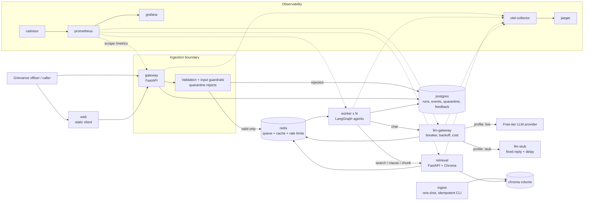
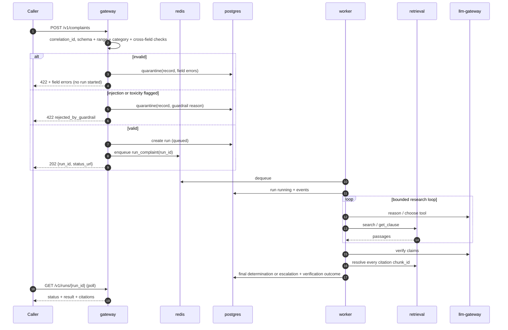
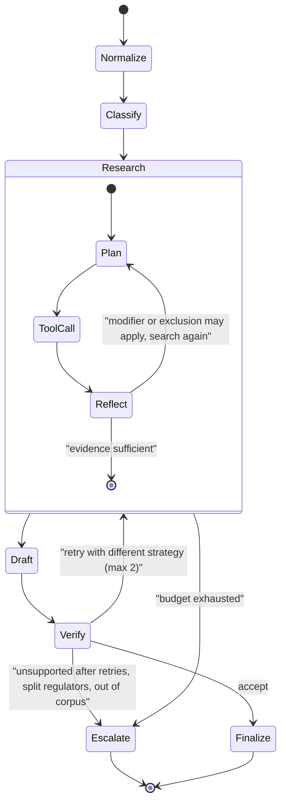
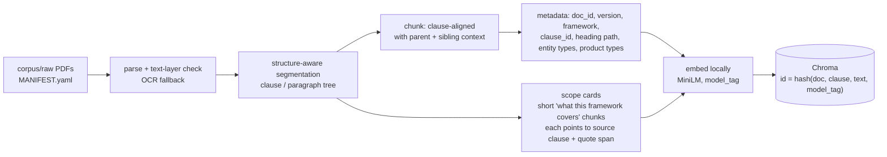
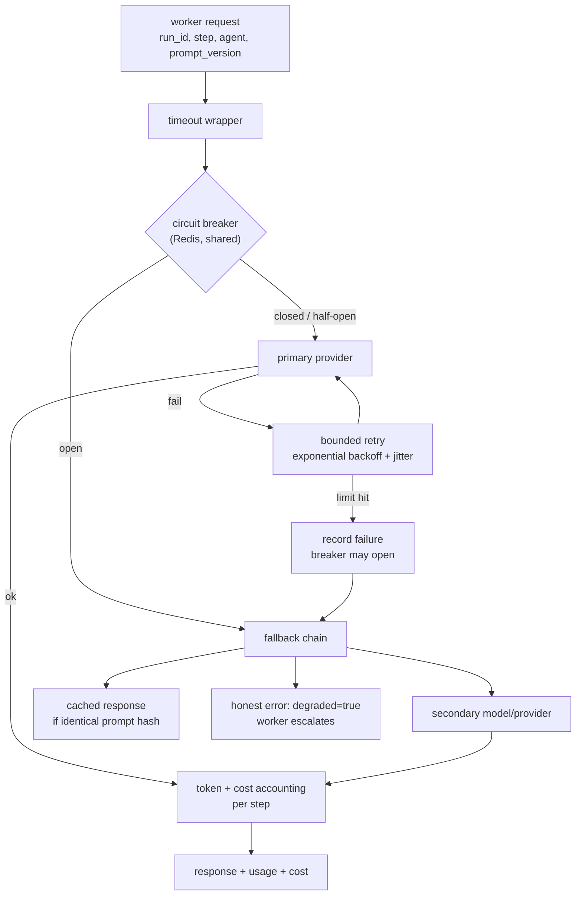

# ORCAS Architecture

Status: design baseline (Day 0). Anything marked **[TBD]** is decided by the owner on the named day and recorded as an ADR in `docs/decisions/`.

## 1. Goals that drive the architecture

| Goal | Consequence |
|---|---|
| A run takes tens of seconds | Asynchronous: submit returns a `run_id` immediately; caller polls. Queue between submission and execution. |
| Wrong routing delays redress; a confident wrong answer is worse than an escalation | Mandatory verification gate; unverified or incomplete runs never return as confident answers. |
| Agents multiply model calls and cost | Loop limits, caching, per-client rate limiting, per-step cost accounting. |
| Three people must work independently | Contract-first design; each person owns whole services; every dependency can be mocked. |
| Whole run must be reconstructible from `run_id` | Correlation ID everywhere; run events persisted; OTel traces. |

## 2. System context and containers

### 2.1 Deployment boundaries (and why)

A deployment boundary is the unit that is built, scaled, restarted and released together.

| Service | Boundary reason |
|---|---|
| **gateway** | *Scaling & failure isolation.* Cheap, latency-sensitive, must stay up when agents are slow or crashing. Scales on request rate. |
| **worker** | *Scaling & resource profile.* Long-running, I/O-bound waiting on LLM calls; scaled with `--scale worker=3`. A crashing agent run must not take down intake. Stateless; state is in Postgres/Redis. |
| **retrieval** | *Resource profile & independent release.* Holds the embedding model and vector index in memory (hundreds of MB). Re-embedding or re-indexing can be released without touching agents. |
| **llm-gateway** | *Failure isolation & independent release.* Only component that holds provider credentials. Circuit-breaker state is **shared across all workers** (kept in Redis); a per-worker breaker would let 3 workers each hammer a dead provider. |
| **llm-stub** | *Test isolation.* Same API as llm-gateway's upstream so load tests measure ORCAS, not provider rate limits. |
| **ingest** | *Lifecycle.* Batch job, not a server. Runs at start and on demand; idempotent. |
| **web** | *Independent release.* Static client; no business logic. |
| **redis / postgres** | *State separation.* Redis = ephemeral (queue, cache, rate limit, breaker). Postgres = durable (runs, events, quarantine, feedback). |
| **prometheus / grafana / otel-collector / jaeger / cadvisor** | *Observability plane*, separate from the data plane so monitoring survives application failure. |

Rejected: a single "agent + retrieval" container (shares one deployment boundary regardless of code separation, so retrieval memory would be duplicated on every scaled worker); a worker-embedded breaker (see above).

## 3. Request lifecycle

Polling vs callback: polling is chosen as the default because the caller is a simple web client and polling needs no inbound reachability or retry logic on the caller's side. A callback can be added as an optional `webhook_url` later; it is explicitly not in the baseline.

## 4. Agent topology (worker)

Two agents with distinct responsibilities and a defined hand-off. They are separate LangGraph graphs with separate prompts, tool permissions and state schemas; the Verifier cannot call search tools that mutate the Researcher's evidence.

| Agent | Responsibility | Tools it may call |
|---|---|---|
| **Researcher** | Classify the complaint; identify product and entity; find the applicable framework; look for modifying/excluding provisions; assemble an *evidence ledger*; draft a determination | `search_corpus`, `get_clause`, `get_complaint_fields`, `list_framework_scope` |
| **Verifier** | Independently check the draft: every claim supported, every citation resolves to retrieved text, route consistent with evidence, no forbidden outcome. Returns `accept`, `retry(strategy)` or `escalate(reason)` | `resolve_citation` (read-only chunk lookup); LLM claim-checking |

### 4.1 Hand-off contract
Researcher → Verifier payload: `{complaint_fields, evidence_ledger[{chunk_id, text, query, tool, step}], draft_determination, claims[{text, citation_ids}]}`. Verifier → Researcher: `{decision, failed_claims, suggested_strategy}`.

### 4.2 Retry strategies (rotated, never repeated)
1. **Query rewrite from what was read**: build a new query from terms in retrieved passages (e.g., the product or entity class named in a scope clause).
2. **Framework swap**: search the *other* regulator's corpus using the product/entity extracted (this is the step that fixes the §4.1 bank-FD case).
3. **Cross-reference follow**: fetch clauses referenced by id from retrieved passages via `get_clause`.

### 4.3 Failure behaviour
| Failure | Behaviour |
|---|---|
| Researcher crashes / times out mid-run | Run ends `escalated` with `reason_code=agent_failure`, partial evidence attached, `degraded=true`. Celery retry only if the failure was before the first LLM call (idempotent restart). |
| Verifier unavailable or times out | **Never return unverified.** Escalate with `reason_code=verification_unavailable`. |
| Loop budget exhausted (steps / tool calls / wall clock) | Escalate with `reason_code=budget_exhausted`. |
| LLM provider circuit open | Fallback chain (below); if none usable, escalate or honest error, never a stack trace. |
| Worker killed | Celery `acks_late` redelivers; run-store keys make the restart idempotent; run events show the duplicate attempt. |

### 4.4 Escalation triggers (F7)
Complaint spans two regulators · entity type outside corpus (e.g., insurer, pension fund, exchange not covered) · classification confidence below threshold · verification fails after retries · budget exhausted · guardrail flags · degraded dependency.

### 4.5 Loop bounds (A1)
Configurable via env: `MAX_STEPS`, `MAX_TOOL_CALLS`, `RUN_WALL_CLOCK_S`, `MAX_VERIFY_RETRIES=2`. Defaults chosen from evaluation and recorded in docs.

## 5. Retrieval and indexing design

Why this addresses the corpus difficulty (frameworks list what they cover, not what they exclude):
- **Clause-aligned chunks with heading-path metadata** keep a clause together with its governing heading, so "covers: banks, NBFCs, …" is retrievable as one unit.
- **`framework` filter on search** lets the agent deliberately query the *other* regulator.
- **Scope cards** are derived summaries of coverage clauses that give the agent an entry point when the complaint's vocabulary does not match the framework's. Rule: a scope card is a *finding aid*, not evidence. Citations must resolve to the **source clause chunk**, never to the summary.
- **Hybrid retrieval (dense + BM25)** [TBD by Tahir after a quick A/B on the eval set].
- **Idempotency**: chunk IDs are content hashes, so re-running never duplicates. Re-embedding replaces vectors for one `model_tag` by id; no full rebuild.
- **Freshness**: `index_info` records build time, document versions, chunk counts and model tag; exposed as metrics and in every determination as `index_version`.

## 6. LLM gateway and resilience

Every degraded or retried path sets flags that surface in the result (`degraded`) and in metrics. No path returns a confident answer from an incomplete run.

## 7. Data stores

| Store | Content | Notes |
|---|---|---|
| Postgres `runs` | run_id, client_id, status, payload hash, result JSON, prompt versions, index_version, timestamps | Source of truth for the API |
| Postgres `run_events` | run_id, seq, ts, agent, step, kind (llm_call/tool_call/verify/…), query, passages, latency, tokens, cost | Enables the "reconstruct from run_id" requirement |
| Postgres `quarantine` | raw record, field-level errors, reason, ts | Rejected input; *no run row exists* |
| Postgres `feedback` | run_id, rating, reason, ts | L6 |
| Postgres `eval_scores` | sampled live runs and their metric scores | L6 chart |
| Redis | Celery broker, retrieval cache, run cache, rate-limit counters, breaker state | Ephemeral, rebuilt on loss |
| Chroma volume | embeddings + metadata | Written only by `ingest` |

## 8. Observability

- **Logs**: JSON, fields `ts, level, service, correlation_id, run_id, agent, step, event, latency_ms`.
- **Correlation ID**: created at gateway (or accepted from `X-Correlation-ID`), propagated via HTTP header, Celery headers and OTel baggage; equals the `run_id` for run-level work.
- **Tracing**: OpenTelemetry SDK in all four Python services → collector → Jaeger. One trace per run; spans per agent step, tool call and LLM call.
- **Metrics (Prometheus, `orcas_` prefix)**: request rate/latency histograms, run end-to-end latency, per-step latency, runs by outcome, steps and tool calls per run, retry count, breaker state, LLM tokens and cost by step, cache hit ratio, queue depth, ingest throughput, index freshness, chunk count.
- **Dashboards (Grafana)**: p50/p95 latency, error rate, throughput, availability, container CPU/memory (cAdvisor), agent KPIs (A6), cost panel (L5), quality over time (L6), index freshness.
- **Reconstruction**: `GET /v1/runs/{id}/trace` returns the ordered `run_events` including every query, passage, prompt version, per-step latency and cost, and the verification outcome.

## 9. Security and guardrails

| Layer | Control | Owner |
|---|---|---|
| Ingestion | Prompt-injection heuristics + classifier on every free-text field; toxicity check; length and character limits; rejects go to quarantine | Jignas |
| Prompting | Untrusted text delimited and labelled as data; tools never receive raw complaint text as instructions; tool args validated | Mitesh |
| Tools | Read-only tools only; no tool can change a determination or write outside the run | Mitesh |
| Output | Output filter: allowed `route` enum only, `disposed=false` enforced, forbidden phrases ("approved", "resolved", "compensation granted") blocked; toxicity check on output | Mitesh |
| Secrets | Only llm-gateway holds provider keys; all config injected from env; `.env.example` documented; secret scanning in CI | Jignas / Mitesh |

## 10. Scaling model

Throughput limit candidates, in order of expectation: (1) free-tier LLM rate limits (removed by the stub), (2) worker concurrency × per-call latency, (3) retrieval CPU (embedding the query), (4) Postgres writes from `run_events`, (5) Redis. `--scale worker=3` helps only if (2) is the bottleneck; otherwise the actual bottleneck is identified from Grafana and reported (A7).

## 11. Interface summary

Full machine-readable specs live in `contracts/`. Summary:

| Interface | Producer → Consumer | Contract file |
|---|---|---|
| `POST /v1/complaints`, `GET /v1/runs/{id}` | gateway → client | `complaint.v1.schema.json`, `run_status.v1.schema.json`, `determination.v1.schema.json` |
| `GET /v1/runs/{id}/trace`, `POST /v1/runs/{id}/feedback` | gateway → client | `trace.v1.schema.json`, `feedback.v1.schema.json` |
| `POST /v1/search`, `GET /v1/clauses/{doc}/{clause}`, `GET /v1/chunks/{chunk_id}`, `GET /v1/index/info` | retrieval → worker, eval | `retrieval.openapi.yaml` |
| `POST /v1/chat` | llm-gateway → worker, eval | `llm_gateway.openapi.yaml` |
| Celery task `orcas.run_complaint(run_id)` | gateway → worker | `contracts/README.md` |
| `RunStore` Python interface (Postgres + in-memory impl) | libs → gateway, worker | `libs/orcas_common/runstore.py` |

## 12. Decisions and rejected alternatives (summary)

| Decision | Chosen | Rejected and why |
|---|---|---|
| Vector store | Chroma | FAISS: no native upsert/delete by id, so re-embedding without a full rebuild needs extra bookkeeping |
| Queue | Celery + Redis | Plain `BackgroundTasks`: no queue, tasks die with the process; RabbitMQ: extra service for no gain here |
| Breaker location | llm-gateway, state in Redis | Per-worker breaker: not shared across scaled workers |
| Agent framework | LangGraph | CrewAI: weaker control over bounded loops and explicit state |
| Embeddings | Local MiniLM | Paid API embeddings: the only real cost in the project |
| Result delivery | Polling | Callbacks: more moving parts, no benefit for a browser client |
